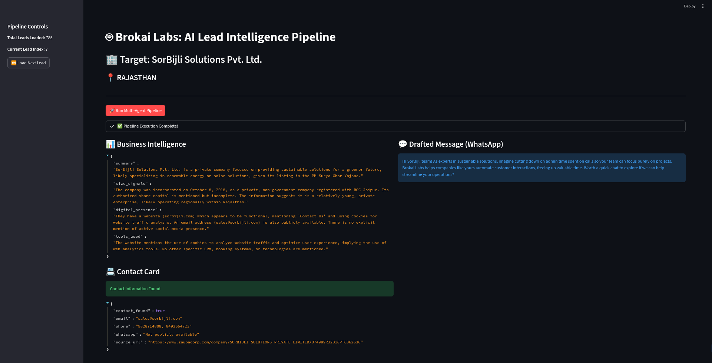
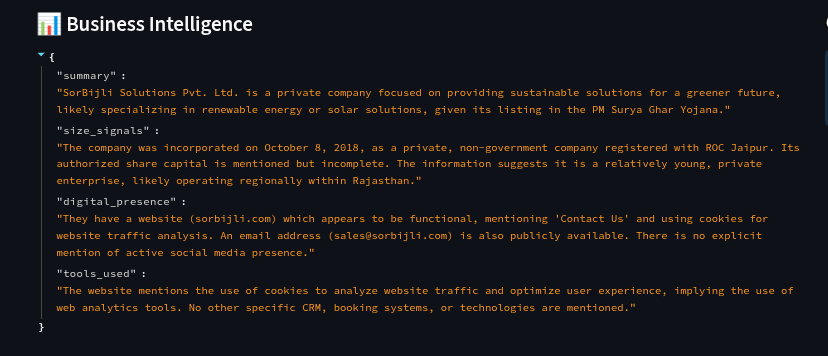
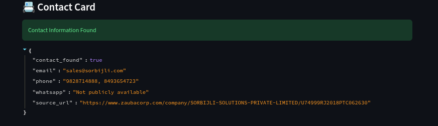
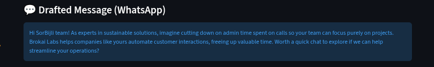

# 🤖 Brokai Labs: Multi-Agent Lead Intelligence Pipeline

This project is a fully automated, multi-agent AI pipeline built for the Brokai Labs take-home assessment. It processes raw lead lists, researches companies, extracts hard-to-find contact information, and generates hyper-personalized outreach messages using the Gemini API.

## 📂 Project Architecture (Directory Tree)

```text
brokai_labs/
├── agents/
│   ├── researcher.py       # Agent 01: Scrapes web to build a JSON Business Profile
│   ├── contact_finder.py   # Agent 02: Hunts for emails/phones & handles graceful fallbacks
│   └── outreach_writer.py  # Agent 03: Drafts personalized cold outreach based on Agents 1 & 2
├── data/
│   └── Rajasthan Solar leadlist.xlsx # Raw input data
├── utils/
│   └── search_tools.py     # Custom DDGS search & Regex-powered HTML scraper
├── .env.example            # Template for API keys
├── .gitignore              # Keeps secrets and virtual environments out of version control
├── main.py                 # Streamlit UI & Pipeline Orchestrator
└── requirements.txt        # Python dependencies
```

🚀 How to Run Locally
1. Clone the repository and navigate to the folder:

```text
git clone [https://github.com/YOUR_USERNAME/brokai-ai-pipeline.git](https://github.com/YOUR_USERNAME/brokai-ai-pipeline.git)
cd brokai-ai-pipeline
```


2. Create and activate a virtual environment:

```text
python -m venv venv
source venv/bin/activate  # On Windows use: venv\Scripts\activate
```

3. Install dependencies:

```text 
pip install -r requirements.txt
```

4. Set up your environment variables:

  Rename .env.example to .env.

  Add your Gemini API key: GEMINI_API_KEY=your_key_here

5. Run the Streamlit Dashboard:

```text 
streamlit run main.py
```

## 📱 Dashboard Preview


### 🔍 Agent Outputs




# 🧠 Engineering Challenges & Solutions
Building a robust scraper without relying on expensive, paid APIs (like Google Maps or Apify) presented several real-world engineering challenges. Here is how the pipeline was hardened to overcome them:

1. The "Dirty Data" Problem
The Issue: The raw Excel file had inconsistent formatting, unnamed columns, and missing location data.

The Solution: Implemented Pandas preprocessing in main.py to map the correct name and location columns dynamically, drop empty rows, and inject default values so the agents never receive NaN inputs.

2. JavaScript Obfuscation & Directory Bot-Protection
The Issue: Major directories (Justdial, IndiaMART) hide phone numbers behind JavaScript clicks, and registry sites (ZaubaCorp) use Cloudflare to mask emails as [email protected] in the raw HTML. Standard requests libraries couldn't see the data.

The Solution: Regex Metal Detector: Built a custom regex scanner (\b[6-9]\d{9}\b) in search_tools.py that scans the raw source code before BeautifulSoup cleans the HTML, successfully extracting hidden Indian mobile numbers.

LLM Guardrails: Added strict anti-hallucination prompts to Agent 02 so it recognizes Cloudflare's [email protected] trap and safely outputs "Not publicly available" rather than hallucinating fake data.

3. SEO Hijacking
The Issue: Searching DuckDuckGo for Company Name + Justdial OR IndiaMART caused the massive directories to overpower the search, returning generic homepages instead of the specific company profile.

The Solution: Removed Boolean operators from the DDG query. Instead, implemented a custom Domain Priority Sorter in Agent 02. The script pulls a wide net of standard search results, then mathematically bumps high-value registry sites (like companydetails.in) to the front of the scraping queue.

4. API Rate Limits & Graceful Degradation
The Issue: Running three AI agents back-to-back instantly triggered Google's free-tier 429 RESOURCE_EXHAUSTED rate limits.

The Solution: Implemented a strict time.sleep(8) pacing mechanism in the orchestrator.

Built NoneType safety nets between the agents. If Agent 01 or 02 hits a timeout, they return empty dictionaries instead of crashing. Agent 03 is programmed to ingest this empty data, realize the contact info is missing, and gracefully pivot from drafting a WhatsApp message to drafting a LinkedIn DM—keeping the Streamlit UI alive 100% of the time.
